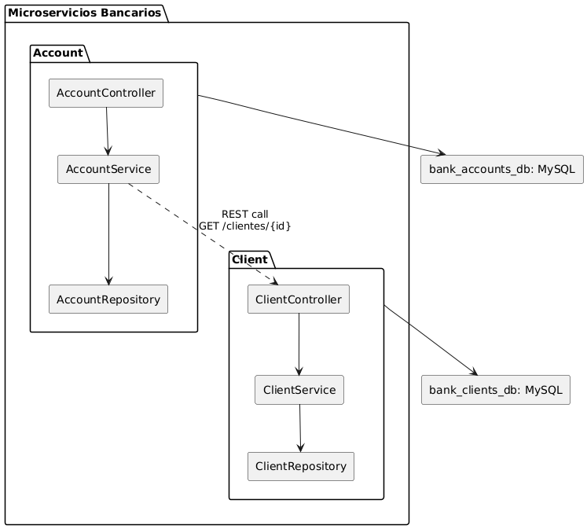

## 🧩 Arquitectura de Microservicios

**Figura 1.** Diagrama de componentes que muestra la interacción entre `Client` y `Account`, conectados a la base de datos `bank_clients_db ` y `bank_accounts_db ` (MySQL) respectivamente y comunicándose vía REST para validar clientes antes de crear cuentas.

### Microservicios

- **ClientMs**
  - CRUD de clientes
  - Endpoints: `POST /clientes`, `GET /clientes`, `GET /clientes/{id}`, `PUT /clientes/{id}`, `DELETE /clientes/{id}`
  - Validaciones: DNI único, no eliminar cliente con cuentas activas

- **AccountMs**
  - CRUD de cuentas bancarias
  - Endpoints: `POST /cuentas`, `GET /cuentas`, `GET /cuentas/{id}`, `PUT /cuentas/{cuentaId}/depositar`, `PUT /cuentas/{cuentaId}/retirar`, `DELETE /cuentas/{id}`
  - Validaciones: saldo inicial > 0, retiro no puede dejar saldo negativo en cuentas de ahorro, sobregiro hasta -500 en cuentas corrientes

### Base de Datos

- Cada microservicio tiene una base de datos:  `client` conectado a `bank_clients_db ` (MySQL) y `Account` connectado a `bank_accounts_db ` (MySQL)

### Comunicación

- `AccountMs` realiza llamadas REST a `ClientMs` para validar la existencia del cliente antes de crear una cuenta (`GET /clientes/{id}`)
